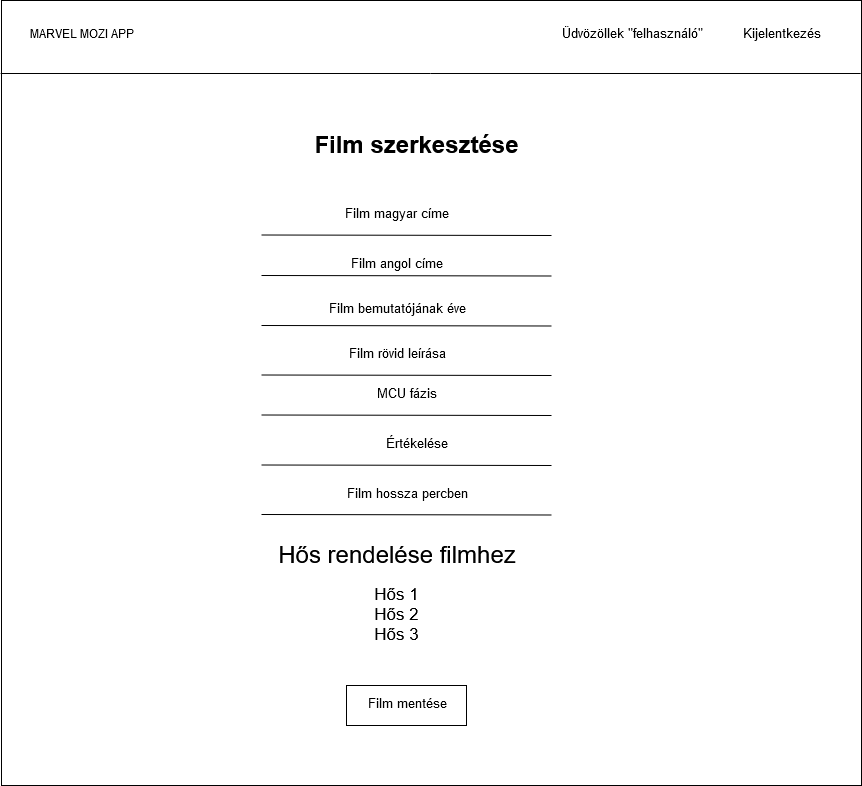
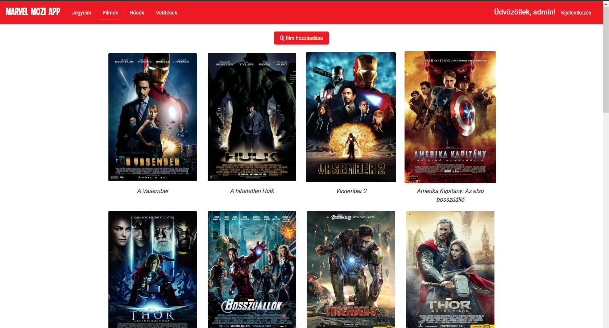
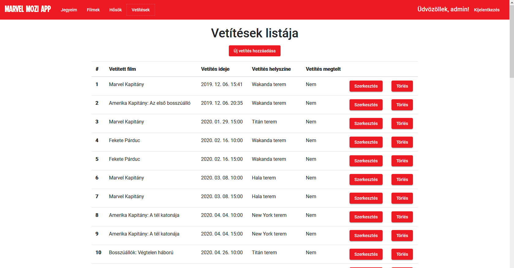

# Marvel Mozi Alkalmazás

## Alkalmazások fejlesztése project - 2019.

**Szerzők:** Páldi Ákos, Zsár Ádám Ottó

## Tartalomjegyzék

- [Követelményanalízis](#követelményanalízis)
  - [Funkcionális követelmények](#funkcionális-követelmények)
  - [Nem funkcionális követelmények](#nem-funkcionális-követelmények)
  - [Fogalomjegyzék](#fogalomjegyzék)
  - [Szerepkörök](#szerepkörök)
  - [Használati esetek](#használati-esetek)
  - [Folyamatok meghatározása](#folyamatok-meghatározása)
	- [Felhasználó](#felhasználó)
	- [Admin](#admin)
	- [Jegyvásárlás folyamata](#jegyvásárlás-folyamata)
- [Tervezés](#tervezés)
  - [Oldaltérkép](#oldaltérkép)
  - [Végpontok](#végpontok)
	- [Vendég (ROLE_GUEST)](#user-endpoint)
	- [Felhasználó (ROLE_USER) / Admin (ROLE_ADMIN)](#user-admin-endpoint)
	- [Admin (ROLE_ADMIN)](#admin-endpoint)
  - [Oldalvázlatok](#oldalvázlatok)
	- [Regisztrációs felület](#regisztrációs-felület)
	- [A bejelentkezési felület](#a-bejelentkezési-felület)
	- [Filmeket tartalmazó oldal felülete.](#filmeket-tartalmazó-oldal-felülete)
	- [Hősöket tartalmazó oldal felülete](#hősöket-tartalmazó-oldal-felülete)
	- [Egy kiválasztott film adatait tartalmazó oldal felülete](#egy-kiválasztott-film-adatait-tartalmazó-oldal-felülete)
	- [Egy kiválasztott hős adatait tartalmazó oldal felülete](#egy-kiválasztott-hős-adatait-tartalmazó-oldal-felülete)
	- [Vetítéseket tartalmazó oldal felülete](#vetítéseket-tartalmazó-oldal-felülete)
	- [Vetítés szerkesztése oldal felülete](#vetítés-szerkesztése-oldal-felülete)
	- [Vetítés hozzáadása oldal felülete](#vetítés-hozzáadása-oldal-felülete)
	- [Hős hozzáadása oldal felülete](#hős-hozzáadása-oldal-felülete)
	- [Hős szerkesztése oldal felülete](#hős-szerkesztése-oldal-felülete)
	- [Film hozzáadása oldal felülete](#film-hozzáadása-oldal-felülete)
	- [Film szerkesztése oldal felülete](#film-szerkesztése-oldal-felülete)
	- [Felhasználó jegyeit megjelenítő oldal felülete](#felhasználó-jegyeit-megjelenítő-oldal-felülete)
	- [Jegyvásárlás oldal felülete](#jegyvásárlás-oldal-felülete)
  - [Adatmodell](#adatmodell)
  - [Adatbázisterv](#adatbázisterv)
	- [USER tábla](#user-tábla)
	- [TICKET tábla](#ticket-tábla)
	- [PROJECTION tábla](#projection-tábla)
	- [ROOM tábla](#room-tábla)
	- [MOVIE tábla](#movie-tábla)
	- [HERO tábla](#hero-tábla)
- [Implementáció](#implementáció)
  - [Fejlesztői környezet - Backend](#fejlesztői-környezet---backend)
  - [Könyvtárstruktúra - Backend](#könyvtárstruktúra---backend)
  - [Fejlesztői környezet - Frontend](#fejlesztői-környezet---frontend)
  - [Könyvtárstruktúra - Frontend](#könyvtárstruktúra---frontend)
	- [Komponensek](#komponensek)
- [Felhasználói dokumentáció](#felhasználói-dokumentáció)
  - [Előkészületek](#előkészületek)
	- [Backend](#pr-backend)
	- [Frontend](#pr-frontend)
  - [Futtatás](#futtatás)
	- [Backend](#run-backend)
	- [Frontend](#run-frontend)
  - [Authentikáció](#authentikáció)
  - [Applikáció használata](#applikáció-használata)
  - [Oldalak](#oldalak)
	- [A regisztrációs oldal](#a-regisztrációs-oldal)
	- [A bejelentkezési oldal](#a-bejelentkezési-oldal)
	- [Filmeket tartalmazó oldal](#filmeket-tartalmazó-oldal)
	- [Hősöket tartalmazó oldal](#hősöket-tartalmazó-oldal)
	- [Egy kiválasztott film adatait tartalmazó oldal](#egy-kiválasztott-film-adatait-tartalmazó-oldal)
	- [Egy kiválasztott hős adatait tartalmazó oldal](#egy-kiválasztott-hős-adatait-tartalmazó-oldal)
	- [Vetítéseket tartalmazó oldal](#vetítéseket-tartalmazó-oldal)
	- [Vetítés hozzáadása/szerkesztése oldal](#projection-add-edit-site)
	- [Hős hozzáadása/szerkesztése oldal](#hero-add-edit-site)
	- [Film hozzáadása/szerkesztése oldal](#movie-add-edit-site)
	- [Felhasználó jegyeit megjelenítő oldal](#felhasználó-jegyeit-megjelenítő-oldal)
	- [Jegyvásárlás oldal](#jegyvásárlás-oldal)

Az API egy Marveles mozihoz tartozó adatokat fog kezelni, úgy mint:  
- mozifilmek
- mozijegyek
- mozitermek  

## Követelményanalízis

### Funkcionális követelmények

- Vendégként szeretném böngészni a filmeket, illetve legyen lehetőségem szűrésre is --> **Filmek böngészése**
- Felhasználóként szeretnék a böngészésen túl jegyet vásárolni egy kiválasztott filmre --> **Jegyvásárlás**
- Felhasználóként szeretném látni a lefoglalt jegyeimet --> **Saját jegyek listázása**
- Adminisztrátorként szeretném módosítani az adatokat --> **Adatmódosítás**
- Adminisztrátorként szeretném törölni az adatokat --> **Adattörlés**
- Adminisztrátorként szeretnék új adatot felvenni --> **Adatfelvétel**
- A felhasználók és az adminisztrátor bejelentkezés után használhatják a funkciókat. Ezeket egy előre megadott listából, vagy LDAP - authentikációval kell elvégezni.
- A főoldalon az alkalmazás ismertetése jelenik meg
 
### Nem funkcionális követelmények

- Felhasználóbarát, ergonomikus elrendezés és reszponzív kinézet (Bootstrap).
- Gyors működés.
- Biztonságos működés: jelszavak tárolása, funkciókhoz való hozzáférés.

### Fogalomjegyzék

- **Felhasználói fiók:** A felhasználói fiók segítségével a felhasználó autentikálhatja (hitelesítheti) magát a rendszer szolgáltatásai felé. 
- **Autentikáció:** Autentikáció során a felhasználónak jellemzően hitelesítenie kell magát jelszó vagy más hitelesítő adat megadásával.
- **Mozi:** A mozi, vagy filmszínház azt a helyet jelöli, amelyet abból a célból hoznak létre, hogy benne filmeket vetítsenek.
- **Mozijegy:** Részvételre jogosító (digitális) cédula, amely egy személyt feljogosít egy filmvetítés megtekintésére. A mozijegy meghatározott filmre, vetítési időpontra és teremre szól.
- **Film:** Képekből álló sorozat, amely a vásznon olyan gyorsan változik, hogy azt az illúziót kelti, mintha mozogna.
- **Terem:** Az a helység, ahol filmeket vetítenek.
- **Hős:** Olyan férfi vagy nő, aki film központi szereplője, egy átlagos személynél lényegesen kiválóbb jellem vagy rendkívüliek a tulajdonságai.
- **Jegyvásárlás:** Az a tevékenység, mely során a személy pénzt ad egy szolgáltatásért cserébe. Jelen esetben ez a szolgáltatás a filmvetítés megtekintésére vonatkozik.

### Szerepkörök

- **Vendég (ROLE_GUEST):** Az a személy, aki nem regisztrált az oldalra, ezért nem veheti igénybe az API szolgáltatásait.     Lehetősége van regisztrálni.
- **(Regisztrált) Felhasználó (ROLE_USER):** Az a személy, aki az API szolgáltatás használója. Regisztrált felhasználói fiókját használva böngészheti a filmeket, jegyet vásárolhat, valamint kezelheti az általa vásárolt jegyeket.
- **Adminisztrátor (ROLE_ADMIN):** Az a személy, aki az API szolgáltatás vezető felügyelője. Hozzáférése van az API által kezelt adatokhoz.

### Használati esetek

Felhasznált Forrás: [draw.io](https://www.draw.io)

### Folyamatok meghatározása

#### Felhasználó
- Jegyvásárlás folyamata
- Jegy törlésének folyamata
- Filmhez tartozó adatok megtekintésének folyamata
- Hőshöz tartozó adatok megtekintésének folyamata
- Vetítések megtekintésének folyamata
- Megvásárolt jegyek megtekintésének folyamata
	
#### Admin:
- Film törlésének folyamata
- Filmhez tartozó adatok módosításának folyamata
- Film létrehozásának folyamata
- Hős törlésének folyamata
- Hőshöz tartozó adatok módosításának folyamata
- Hős létrehozásának folyamata
- Vetítés törlésének folyamata
- Vetítés létrehozásának folyamata
- Vetítés módosításának folyamata

#### Jegyvásárlás folyamata

Felhasznált Forrás: [draw.io](https://www.draw.io)

## Tervezés

### Oldaltérkép

- Publikus:
	- Főoldal
	- Regisztráció
	- Bejelentkezés
	
- Felhasználó:
	- Főoldal
	- Bejelentkezés/Kijelentkezés
	- Jegyeim
	- Filmek
		- Film adatai
		- Jegyvásárlás
	- Hősök
		- Hősök képernyő
		
- Admin:
	- Főoldal
	- Bejelentkezés/Kijelentkezés
	- Jegyeim
	- Filmek
		- Új film létrehozása
		- Film adatai
			- Film szerkesztése
		- Jegyvásárlás
	- Hősök
		- Új hős létrehozása
		- Hősök képernyő
			- Hős szerkesztése
	- Vetítések listája
		- Új vetítés létrehozása
		- Vetítés szerkesztése
		
### Végpontok

#### Vendég (ROLE_GUEST) 

Metódus | Kérés | Leírás
--------- | ----- | ------
POST | /users/register | Regisztrál az oldalra a megadott felhasználói adatokkal.

#### Felhasználó (ROLE_USER) / Admin (ROLE_ADMIN) 

Metódus | Kérés | Leírás
--------- | ----- | ------
POST | /users/login | Bejelentkeztet a meagadott adatokkal.
GET | /users/id/tickets | Az adott felhasználó jegyei.
GET | /heroes | Kilistázza a hősöket.
GET | /heroes/id | Az adott azonosítójú hőst listázza ki.
GET | /movies | Kilistázza a filmeket.
GET | /movies/id | Addot azonosítójú filmet listázza ki.
GET | /movies/id/projections | Az adott azonosítóval rendelkező, filmhez tartozó vetítéseket listázza ki.
GET | /movies/id/heroes | A megadott filmben szerepló hősöket listázza ki.
GET | /projections | A vetítéseket listázza ki.
GET | /projections/id | Adott azonosítójú vetítést listázza ki.
GET | /projections/id/tickets | A vetítéshez tartozó jegyek(jegyvásárlás).
GET | /rooms | Termek kilistázása.
GET | /rooms/id | Adott terem kilistázása.
GET | /tickets | Jegyek listázása.

#### Admin (ROLE_ADMIN) 

Metódus | Kérés | Leírás
--------- | ----- | ------
GET | /heroes/id/movies | Azokat a filmeket listázza amelyekben szerepel az adott hős.
POST | /heroes	 | Új hős felvétele
PUT | /heroes/id | Adott hős adatainak módosítása.
DELETE | /heroes/id | Hős törlése.
POST | /movies | Film felvétele.
PUT | /movies/id | Adott film módosítása.
DELETE | /movies/id | Film törlése.
POST | /projections | Vetítés felvétele.
PUT | /projections/id | Adott vetítés módosítása.
DELETE | /projections/id | Vetítés törlése.

### Oldalvázlatok

#### Regisztrációs felület

Felhasznált Forrás: [draw.io](https://www.draw.io)

#### A bejelentkezési felület

Felhasznált Forrás: [draw.io](https://www.draw.io)

#### Filmeket tartalmazó oldal felülete

Felhasznált Forrás: [draw.io](https://www.draw.io)

#### Hősöket tartalmazó oldal felülete

Felhasznált Forrás: [draw.io](https://www.draw.io)

#### Egy kiválasztott film adatait tartalmazó oldal felülete

Felhasznált Forrás: [draw.io](https://www.draw.io)

#### Egy kiválasztott hős adatait tartalmazó oldal felülete

Felhasznált Forrás: [draw.io](https://www.draw.io)

#### Vetítéseket tartalmazó oldal felülete

Felhasznált Forrás: [draw.io](https://www.draw.io)

#### Vetítés szerkesztése oldal felülete

Felhasznált Forrás: [draw.io](https://www.draw.io)

#### Vetítés hozzáadása oldal felülete

Felhasznált Forrás: [draw.io](https://www.draw.io)

#### Hős hozzáadása oldal felülete

Felhasznált Forrás: [draw.io](https://www.draw.io)

#### Hős szerkesztése oldal felülete

Felhasznált Forrás: [draw.io](https://www.draw.io)

#### Film hozzáadása oldal felülete

Felhasznált Forrás: [draw.io](https://www.draw.io)

#### Film szerkesztése oldal felülete

Felhasznált Forrás: [draw.io](https://www.draw.io)

#### Felhasználó jegyeit megjelenítő oldal felülete

Felhasznált Forrás: [draw.io](https://www.draw.io)

#### Jegyvásárlás oldal felülete

Felhasznált Forrás: [draw.io](https://www.draw.io)

### Adatmodell

Felhasznált Forrás: [draw.io](https://www.draw.io)

### Adatbázisterv

Felhasznált Forrás: [dbdiagram.io](https://dbdiagram.io) 

#### USER tábla

Oszlopnév | Típus | Leírás
--------- | ----- | ------
id | int | elsődleges kulcs
role | enum | ROLE_GUEST \| ROLE_USER \| ROLE_ADMIN
name | varchar | felhasználó neve
email | varchar | felhasználó email címe (belépéshez szükséges)
pass | varchar | felhasználó jelszava (belépéshez szükséges)

#### TICKET tábla

Oszlopnév | Típus | Leírás
--------- | ----- | ------
id | int | elsődleges kulcs
user_id | int | a jegyvásárlást lebonyolító felhasználó ID-je
projection_id | int | a vetítés ID-je, amire szól a jegy
row_num | int | sor száma, ahova szól a jegy
seat_num | int | szék száma, ahova szól a jegy
price | int | jegyár forintban

#### PROJECTION tábla

Oszlopnév | Típus | Leírás
--------- | ----- | ------
id | int | elsődleges kulcs
room_id | int | a vetítést adó terem ID-je
movie_id | int | a vetített film ID-je
time | timestamp | vetítés ideje
is_full | tele van-e a vetített terem

#### ROOM tábla

Oszlopnév | Típus | Leírás
--------- | ----- | ------
id | int | elsődleges kulcs
name | varchar | a terem neve
rows | int | sorok száma
seats | int | egy sorban lévő székek száma

#### MOVIE tábla

Oszlopnév | Típus | Leírás
--------- | ----- | ------
id | int | elsődleges kulcs
title_hu | varchar | film magyar címe
title_en | varchar | film angol címe
year | int | megjelenés éve
description | varchar | film leírása
phase | int | a film melyik fázishoz tartozik az MCU-ban
order_num | int | film sorszáma az MCU idővonala szerint
rate | float | film értékelése  (1-10)
length | int | film hossza percben

#### HERO tábla

Oszlopnév | Típus | Leírás
--------- | ----- | ------
id | int | elsődleges kulcs
name | varchar | hős identitása (valódi neve)
alias | varchar | hős neve
species | varchar | hős faja
portrayed_by | varchar | hőst megformáló színész neve

## Implementáció

### Fejlesztői környezet - Backend

A backend fejlesztése során Spring keretrendszert használtunk.
A Spring egy nyílt forráskódú, inversion of controlt megvalósító Java alkalmazás keretrendszer.
Bővítményei a fejlesztését segítik elő.
Egyik legnagyobb előnye, hogy a fejlesztendő applikáció futtatásához nem szükséges saját webszerver
telepítése és hosszadalmas konfigurálása. A Spring megkönnyíti a programozó dolgát azzal, hogy 
egy Tomcat szervert futtat a háttérben.
A program buildeléséhez és futtatásához a Netbeans IDE programot használtuk.

### Könyvtárstruktúra - Backend

A backend program egy Maven alapú projekt, ami 2.1.8-as verziójú Spring keretrendszert használ.
A `pom.xml` fájl tartalmazza a program függőségeit.

- **Spring Boot Starter Web:** REST API építéséhez szükséges kezdőcsomag Apache Tomcat konténerrel

- **Spring Boot Data JPA Starter:** Java Persistance API. Az objektumok és egy relációs adatbázis közti menezsdelést teszi lehetővé.

- **Spring Boot Developer Tools:** gyors adatbetöltést és kiterjesztett fejlesztői élményt biztosít

- **H2 Database:** Memóriában futó SQL adatbázis

- **Lombok:** Annotációk segítségével tipikus függvényeket (pl. getter, setter) valósít meg.

- **Spring Boot Test Starter:** Az alkalmazás tesztelését segíti elő különböző könyvtárakkal, mint pl. JUnit, Hamcrest és Mockito. (Nincs használva)

- **Spring Boot Security Starter:** Spring Security használata. A felhasználók authorizációjához authentikálásához szükséges.

A program minden futtatásakor automatikusan feltölti adatokkal a táblákat. Ezért az `import.sql`-ben szereplő SQL utasítások felelnek.

Az alkalmazással kapcsolatos további beállítások az `application.properties` fájlban találhatóak.

- **spring.datasource.platform=h2**: az adatbázismotor beállítása

- **spring.h2.console.enabled=true**: h2 web konzol engedélyezése

- **spring.h2.console.path=/h2**: h2 web konzol elérési úzjának beállítása

- **spring.datasource.url=jdbc:h2:mem:marveldb**: adatbázis nevének beállítása

- **spring.datasource.sql-script-encoding=UTF-8**: az SQL scriptek karakterkódolásának beállítása

- **logging.level.org.hibernate.SQL=debug**: SQL utasítások logolása

- **logging.level.org.hibernate.type.descriptor.sql=trace**: SQL értékek mutatása

A forrásmappa a következő elemekből épül fel:

- **hu.elte.marvelcinema**: Itt van az alkalmazás belépési pontja (MarvelCinemaApplication.java), melyben a main() függvény található.

- **hu.elte.marvelcinema.controllers**: Itt találhatóak az adatbázis táblákhoz tartozó kontrollerek, amikben a végpontok vannak definiálva.

- **hu.marvelcinema.entities**: A Spring JPA teszi lehetővé, hogy az adatbázis táblákat entitásokként kezeljük. Itt vannak definiálva ezek az entitások és azok adattagjai, illetve az entitások közötti kapcsolatok.

- **hu.marvelcinema.repositories**: Itt vannak definiálva azokaz interfészek, amiket a kontrollerek használnak az adattáblák módosítására.

- **hu.marvelcinema.security**: Itt van konfigurálva a felhasználók authorizációja és authentikációja.

A `Test Packages` mappa tartalmazná a backend alkalmazáshoz tartozó teszteket, de a programhoz nem készültek tesztek.

### Fejlesztői környezet - Frontend

A frontend fejlesztésére Angular keretrendszert használtunk.
Az Angular egy Google által fejlesztett, nyílt forráskódú Typescript keretrendszer,
dinamikus webes alkalmazásokhoz. Segítségével nagyban egyszerűsödik a webes alkalmazások
frontend fejlesztése. Használatával a HTML eszköztára kibővül és az alkalmazások komponensei
még egyértelműen elkülönülnek. Tökéletes úgynevezett egyoldalú (Single Page Application) alkalmazások fejlesztésére.

### Könyvtárstruktúra - Frontend

A frontend program fejlesztéséhez 8.3.18-as Angular CLI-t és 10.16.3-as verziójú Node-ot használtunk.
A telepítéshez Node csomagkezelőt (npm) használtunk. Az alap Angularos projekt csomagokonkívül a következő npm csomagokat használtuk:

- [Angular Material](https://material.angular.io/): beépített, egyéni stílussal rendelkező angular komponensek

- [flex-layout](https://www.npmjs.com/package/@angular/flex-layout): grid elrendezés használata

- [Bootstrap](https://www.npmjs.com/package/bootstrap) : Bootstrap keretrendszer. Beépített HTML és CSS sablonokat, valamint JavaScript (JQuery) alapú komponenseket tartalmazó könyvtárstruktúra.

- [NG Bootstrap](https://ng-bootstrap.github.io/#/home): Bootstrap alapú angular widgetek

- [Material Time Picker](https://www.npmjs.com/package/@candidosales/material-time-picker): Időpont választása a vetítésekhez

A forrásmappa a következő elemekből épül fel:

- **components**: Itt találhatóak az angular komponensek ezekről részletesebb leírás lentebb olvasható.
- **entities**: A backendben levő entity-k frontendes megfelelője. Definiálja az adattábla objektumokat.
-  **routing**: Az alkalmazás routing táblájának tekinthető. Az ebben levő `routing-module.ts` fájl mondja meg, hogy az alkalmazás útvonalaihoz melyik komponensek tartoznak, illetvee ha az útvonal használata korlátozva van bizonyos felhasználóknak, akkor az is itt van definiálva.
-  **services**: Az adattáblákhoz tartozó szervizek. Ezek a szervizek végzik el a kommunikációt a backend felé. A definiált httpClientobjektumok hívják meg a backend megfelelő végpontjaihoz tartozó kéréseket.
-  **assets**: Ez a mappa tartalmaz minden küldő forrást, amit az alkalmazás használ. Ez jelen esetben egy fontot és a képeket jelenti.

#### Komponensek

Egy angular alkalmazás komponensekből épül fel. Ezek közül is a legalapvetőbb az `App Component`.
Ez az alkalmazás belépési pontja. A mi programunkban ez a komponens nem áll másból, mint egy `Navbar komponensből` és egy `routing modulból`.
Ez a routing modul felel azért, hogy betöltse az `routing-module.ts` fájlból az útvonaltól függően  a megfelelő komponenseket.

Ezt jelenti gyakorlatilag az egyoldalú (Simple Page Application) alkalmazás, hogy ugyanazt az oldalt frissíti dinamikusan az alkalmazás.

- **Navbar Component**: Ez a komponens jeleníti meg a felső navigációs sávot.
- **Home Component**: Ez a komponens jeleníti meg a főoldalt.
- **Login Conponent**: Ez a komponens jeleníti meg a bejelentkező oldalt.
- **Logout Conponent**: Ez a komponens jeleníti meg a kijelentkező oldalt.
- **UserNew Component**: Ez a komponens jeleníti meg a regisztrációs oldalt.
- **Tickets Component**: Ez a komponens jeleníti meg a `Jegyeim` oldalt, ahol a felhasználó megvásárolt jegyei találhatóak.
- **Movies Component**: Ez a komponens jeleníti meg  `Filmek` oldalt, ahol a filmek listája látható.
- **MovieDetail Component**: Ez a komponens jeleníti meg egy adott film adatainak az oldalát.
- **MovieEdit Component**: Ez a komponens jeleníti meg az adminisztrátornak a `Film szerkesztése` oldalt, ahol szerkesztheti a filmet.
- **MovieNew Component**: Ez a komponens jeleníti meg az adminisztrátornak az `Új film létrehozása` oldalt, ahol új filmet adhat az adatbázishoz.
- **MovieForm Component**: Ez a komponens felel a filmek szerkesztésénél és létrehozásánál használt form-ért.
- **Heroes Component**: Ez a komponens jeleníti meg  `Hősök` oldalt, ahol a hősök listája látható.
- **HeroDetail Component**: Ez a komponens jeleníti meg egy adott hős adatainak az oldalát.
- **HeroEdit Component**: Ez a komponens jeleníti meg az adminisztrátornak a `Hős szerkesztése` oldalt, ahol szerkesztheti a hőst.
- **HeroNew Component**: Ez a komponens jeleníti meg az adminisztrátornak az `Új hős létrehozása` oldalt, ahol új hőst adhat az adatbázishoz.
- **HeroForm Component**: Ez a komponens felel a hősök szerkesztésénél és létrehozásánál használt form-ért.
- **Projections Component**: Ez a komponens jeleníti meg az adminisztrátornak a `Vetítések` oldalt, ahol a vetítések listája látható.
- **ProjectionEdit Component**: Ez a komponens jeleníti meg az adminisztrátornak a `Vetítés szerkesztése` oldalt, ahol szerkesztheti a vetítést.
- **ProjectionNew Component**: Ez a komponens jeleníti meg az adminisztrátornak az `Új vetítés létrehozása` oldalt, ahol új vetítést adhat az adatbázishoz.
- **ProjectionForm Component**: Ez a komponens felel a vetítések szerkesztésénél és létrehozásánál használt form-ért.
- **TicketNew Component**: Ez a komponens jeleníti meg a `Jegyvásárlás` oldalt, ahol a felhasználók jegyet vehetnek a filmekre.

## Felhasználói dokumentáció

### Előkészületek
A program lokális futtatásához a következőkre van szükség.
Backend: Apache Maven és Java Development Kit
Frontend: NodeJs, npm, Angular CLI

#### Backend 
A Java fejlesztőkörnyezet használatához töltsük le a [Java JRE](https://www.java.com/en/download/manual.jsp) és [Java JDK](https://www.oracle.com/technetwork/java/javase/downloads/jdk8-downloads-2133151.html) legfrissebb változatát. Telepítés után a parancssori `java -version` paranccsal ellenőrizhetjük a Java megfelelő működését.  
Windows esetén szükséges lehet bizonyos környezeti változók beállítása. 

Ezekhez a Sajátgép (Újabb Windowsok esetén Ez a gép) jobb klikk → Tulajdonságok → Speciális rendszerbeállítások → Speciális fül → Környezeti változók gomb megnyomása után férünk hozzá. A felhasználói és rendszerváltozók közé érdemes felvenni egy új változót JAVA_HOME néven, értéknek pedig a Java jdk elérési útját kell megadni, ami 64 bites operációs rendszerek esetén a C:\Program Files\Java\jdk1.* ahol a * a jdk aktuális verzióját jelenti. Ezeken kívül pedig a rendszerváltozók PATH változójához hozzá kell adni a jdk bin mappájának elérési útját (C:\Program Files\Java\jdk1.*\bin).

[Töltsük le](https://maven.apache.org/download.cgi) az Apache Mavent és csomagoljuk ki egy megfelelő helyre (pl. C:\Program Files)  

A Maven használatához szintén be kell állítanunk néhány környezeti változót. Ezek a MAVEN_HOME és M2_HOME felhasználói változók, értékük pedig a Maven kicsomagolási helye (pl. C:\Program Files\Maven). Végül pedig a PATH változóhoz hozzá kell adni a Maven bin mappáját (pl. C:\Program Files\Maven\bin). Ha mindent jól csináltunk, akkor az `mvn -version` paranccsal ellenőrizhetjük, hogy működik-e terminálban a Maven.

A Java fejlesztőkörnyezetre mindenképpen szükségünk van, de a backend build-eléséhez és futtatásához használhatunk IDE-t is, pl az [Apache Netbeans](https://netbeans.apache.org/download/index.html) nevű programot.

#### Frontend 

A frontend futtatásához [NodeJS](https://nodejs.org/en/download/) telepítése szükséges. Ennek a telepítése után nem szükséges környezeti változók beállítása, a `node -v` és az `npm -v` parancsokkal ellenőrizhetjük a sikeres telepítést.

Emellett szükségünk van még az [Angular CLI](https://cli.angular.io/) telepítésére. Ezt terminálunkon keresztül a node csomagkezelővel megtehetjük. Írjuk be a `npm install -g @angular/cli` parancsot és várjuk meg, míg az Angular CLI feltelepül.

Most már mindenünk megvan az alkalmazás futtatásához.

### Futtatás

#### Backend 

Ha manuálisan telepítettük a Mavent, akkor a buildeléshez futtassuk az `mvn clean install` parancsot. Ezzel a backend buildje elkészül. Létrejött egy `target` mappa, ebbe lépjünk be. Windows esetén a futtatáshoz meg kell adnunk egy encoding flag-et, hogy az sql-ből beolvasott adatok megfelelően jelenjenek meg. Tehát Windows esetén futtassuk a `java -Dfile.encoding=utf-8 -jar MarvelCinema-0.0.1-SNAPSHOT.jar` parancsot. Unix alapú rendszereknél az encoding flag nem szükséges, ott elég futtatni a
`java -jar MarvelCinema-0.0.1-SNAPSHOT.jar` parancsot.

Ha IDE-t használunk, mint pl. Netbeans, akkor csak be kell tölteni a backendet és a program segítségével kell build-elni. Ekkor a Netbeans letölti a szükséges csomagokat. Sajnos a Netbeans sem kezeli jól a karakterkódolást, ezért futtatás előtt a projektre jobb gombbal kattintva, a Properties-re kattintva a Categories → Build → Run fül alatt be kell állítani egyrészt a Main Class értékét `hu.elte.marvelcinema.MarvelCinemaApplication`-re, de ami még fontosabb, hogy a VM Options részhez hozzá kell adni azt, hogy `-Dfile.encoding=utf-8` ahogy azt az alábbi kép is mutatja. Más IDE programoknál, mint pl. IntelliJ, nem szükséges ez a beállítás.

Karakterkódolás beállítása

#### Frontend 

A frontend futtatásához lépjünk be terminállal az `src/client` mappába. Itt először telepítenünk kell a dependenciákat az `npm install` parancs futtatásával. Ezek után futtassuk az `npm start` parancsot.

Ha mindez lefutott, akkor az alkalmazás a [http://localhost:4200](http://localhost:4200) címen elérhetővé válik.

### Authentikáció

Az autentikációban annyi különbség van a példaprogramhoz képest, hogy nem felhasználónévvel kell autentikálni, hanem email címmel.
Adminnál admin@admin.hu, usernél user@user.hu. A jelszü pedig mindkét esetben "password".

### Applikáció használata

[Futtatás](#futtatás) részben leírtak végrehajtása után a http://localhost:4200 linken keresztül elérhetjük az applikációt.
Kezdetben a főoldal fogad minket, mely tartalmaz regisztrációs lehetőséget és bejelentkezési lehetőséget.

Bejelentkezhetünk az [Autentikációs](#autentikáció) részben említett két fiók valamelyikével, illetve regisztrálhatunk is egy saját fiókot.
Miután bejelentkeztünk felhasználóként elérhetővé válnak a **Jegyeim, Filmek, Hősök menüpontok**.

**Jegyeim** menüpont alatt megtekinthetjük a megvásárolt jegyeinket és törölhetjük azokat.
**Filmek** menüpont alatt megtalálhatóak a filmek, melyekre rákattintva elolvashatóak a hozzá tartozó adatok, és megtekinthetőek a vetítési időpontok.
Itt van lehetőségünk jegyet vásárolni egy vetítési időpontra. 

Jegyvásárlás menete: **Jegyvásárlás** gombra kattintás után kiválaszthatjuk az ülőhelyet (sor-oszlop páros bepipálásával),
majd a **jegyek megvétele** gombbal véglegesítjehtjük a jegyvásárlást. Vásárlás után a jegy megjelenik a **Jegyeim** menüpont alatt.

**Hősök** menpontra kattintva megjelennek a marvel univerzum hősei, melyekre rákattintva elolvashatjuk milyen fajhoz tartoznak,
mi a nevük és melyik színész formálja meg őket. Admin felhasználó esetén az eddig említett funkciókon túl lehetőségünk nyílik új film felvételére,
új hős felvételére, és új vetítés felvételére.

Új film felvételét a **Filmek** menüpont **Új film hozzáadása** gombjának megnyomásával lehet kezdeményezni.
A gomb megnyomása után miután az adatokat kitöltöttük (magyar cím, angol cím stb.) a **Film mentése** gombbal menthetjük a filmet.

Hős felvétele a **Hősök** menüpont **Új hős hozzáadása** gombján keresztül lehetséges.
Ekkor szintén megjelenik egy ablak ahol megadhatók a hős adatai, majd a **Hős mentése** gombbal véglegesíthető a hős felvitele.

Vetítés létrehozása a **Vetítés** menüponton keresztül érhető el, mely tartalmmazza az összes film eddigi összes vetítését.
Ebben a menüpontban az **Új vetítés hozzáadása** gombot megnyomva kezdeményezhetünk vetítés létrehozást.
Megadjuk az adatokat és a **Vetítés mentése** gomb megnyomása után a felvett vetítés megjelenik a vetítések listáján, illetve a megadott film vetítési időpontjai között is.
Admin-ként lehetőségünk van a filmek, hősök, vetítések törlésére és szerkesztésére is.

### Oldalak

#### A regisztrációs oldal

#### A bejelentkezési oldal

#### Filmeket tartalmazó oldal

#### Hősöket tartalmazó oldal

#### Egy kiválasztott film adatait tartalmazó oldal

#### Egy kiválasztott hős adatait tartalmazó oldal

#### Vetítéseket tartalmazó oldal

#### Vetítés hozzáadása/szerkesztése oldal 

#### Hős hozzáadása/szerkesztése oldal 

#### Film hozzáadása/szerkesztése oldal 

#### Felhasználó jegyeit megjelenítő oldal

#### Jegyvásárlás oldal

---

[Vissza a Tartalomjegyzékhez](#tartalomjegyzék)
