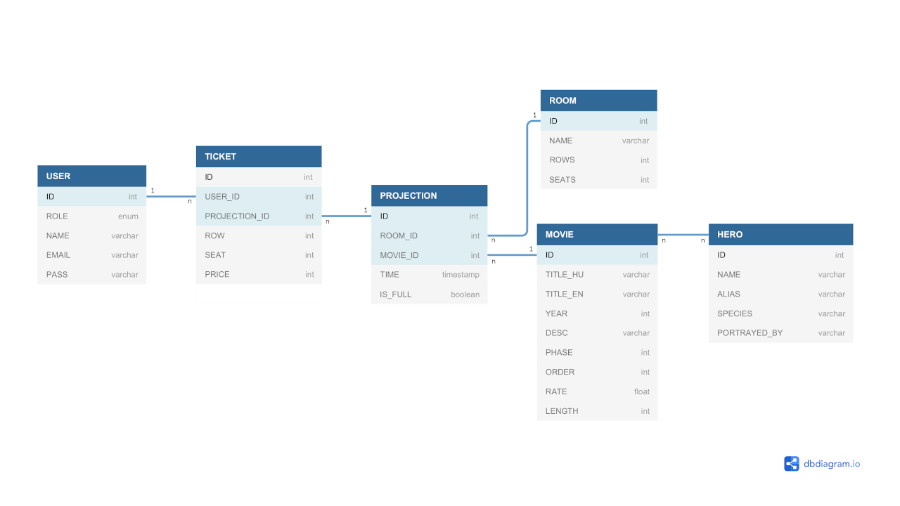

# Marvel Mozi Alkalmazás

## Alkalmazások fejlesztése project - 2019.

**Szerzők:** Páldi Ákos, Zsár Ádám Ottó

## Tartalomjegyzék

- [Leírás](#leírás)
- [Előkészületek](#előkészületek)
  - [Backend](#pr-backend)
  - [Frontend](#pr-frontend)
- [Futtatás](#futtatás)
  - [Backend](#run-backend)
  - [Frontend](#run-frontend)
- [Funkcionális követelmények](#funkcionális-követelmények)
- [Nem funkcionális követelmények](#nem-funkcionális-követelmények)
- [Fogalomjegyzék](#fogalomjegyzék)
- [Szerepkörök](#szerepkörök)
- [Adatbázis és táblák](#adatbázis-és-táblák)
  - [USER](#user)
  - [TICKET](#ticket)
  - [PROJECTION](#projection)
  - [ROOM](#room)
  - [MOVIE](#movie)
  - [HERO](#hero)
- [Autentikáció](#autentikáció)

## Leírás

Az API egy Marveles mozihoz tartozó adatokat fog kezelni, úgy mint:  
- mozifilmek
- mozijegyek
- mozitermek  

## Előkészületek
A program lokális futtatásához a következőkre van szükség.
Backend: Apache Maven és Java Development Kit
Frontend: NodeJs, npm, Angular CLI

### Backend 
A Java fejlesztőkörnyezet használatához töltsük le a [Java JRE](https://www.java.com/en/download/manual.jsp) és [Java JDK](https://www.oracle.com/technetwork/java/javase/downloads/jdk8-downloads-2133151.html) legfrissebb változatát. Telepítés után a parancssori `java -version` paranccsal ellenőrizhetjük a Java megfelelő működését.  
Windows esetén szükséges lehet bizonyos környezeti változók beállítása. 

Ezekhez a Sajátgép (Újabb Windowsok esetén Ez a gép) jobb klikk → Tulajdonságok → Speciális rendszerbeállítások → Speciális fül → Környezeti változók gomb megnyomása után férünk hozzá. A felhasználói és rendszerváltozók közé érdemes felvenni egy új változót JAVA_HOME néven, értéknek pedig a Java jdk elérési útját kell megadni, ami 64 bites operációs rendszerek esetén a C:\Program Files\Java\jdk1.* ahol a * a jdk aktuális verzióját jelenti. Ezeken kívül pedig a rendszerváltozók PATH változójához hozzá kell adni a jdk bin mappájának elérési útját (C:\Program Files\Java\jdk1.*\bin).

[Töltsük le](https://maven.apache.org/download.cgi) az Apache Mavent és csomagoljuk ki egy megfelelő helyre (pl. C:\Program Files)  

A Maven használatához szintén be kell állítanunk néhány környezeti változót. Ezek a MAVEN_HOME és M2_HOME felhasználói változók, értékük pedig a Maven kicsomagolási helye (pl. C:\Program Files\Maven). Végül pedig a PATH változóhoz hozzá kell adni a Maven bin mappáját (pl. C:\Program Files\Maven\bin). Ha mindent jól csináltunk, akkor az `mvn -version` paranccsal ellenőrizhetjük, hogy működik-e terminálban a Maven.

A Java fejlesztőkörnyezetre mindenképpen szükségünk van, de a backend build-eléséhez és futtatásához használhatunk IDE-t is, pl az [Apache Netbeans](https://netbeans.apache.org/download/index.html) nevű programot.

### Frontend 

A frontend futtatásához [NodeJS](https://nodejs.org/en/download/) telepítése szükséges. Ennek a telepítése után nem szükséges környezeti változók beállítása, a `node -v` és az `npm -v` parancsokkal ellenőrizhetjük a sikeres telepítést.

Emellett szükségünk van még az [Angular CLI](https://cli.angular.io/) telepítésére. Ezt terminálunkon keresztül a node csomagkezelővel megtehetjük. Írjuk be a `npm install -g @angular/cli` parancsot és várjuk meg, míg az Angular CLI feltelepül.

Most már mindenünk megvan az alkalmazás futtatásához.

## Futtatás

### Backend 

Ha manuálisan telepítettük a Mavent, akkor a buildeléshez futtassuk az `mvn clean install` parancsot. Ezzel a backend buildje elkészül. Létrejött egy `target` mappa, ebbe lépjünk be. Windows esetén a futtatáshoz meg kell adnunk egy encoding flag-et, hogy az sql-ből beolvasott adatok megfelelően jelenjenek meg. Tehát Windows esetén futtassuk a `java -Dfile.encoding=utf-8 -jar MarvelCinema-0.0.1-SNAPSHOT.jar` parancsot. Unix alapú rendszereknél az encoding flag nem szükséges, ott elég futtatni a
`java -jar MarvelCinema-0.0.1-SNAPSHOT.jar` parancsot.

Ha IDE-t használunk, mint pl. Netbeans, akkor csak be kell tölteni a backendet és a program segítségével kell build-elni. Ekkor a Netbeans letölti a szükséges csomagokat. Sajnos a Netbeans sem kezeli jól a karakterkódolást, ezért futtatás előtt a projektre jobb gombbal kattintva, a Properties-re kattintva a Categories → Build → Run fül alatt be kell állítani egyrészt a Main Class értékét `hu.elte.marvelcinema.MarvelCinemaApplication`-re, de ami még fontosabb, hogy a VM Options részhez hozzá kell adni azt, hogy `-Dfile.encoding=utf-8` ahogy azt az alábbi kép is mutatja. Más IDE programoknál, mint pl. IntelliJ, nem szükséges ez a beállítás.

Karakterkódolás beállítása

### Frontend 

A frontend futtatásához lépjünk be terminállal az `src/client` mappába. Itt először telepítenünk kell a dependenciákat az `npm install` parancs futtatásával. Ezek után futtassuk az `npm start` parancsot.

Ha mindez lefutott, akkor az alkalmazás a [http://localhost:4200](http://localhost:4200) címen elérhetővé válik.

## Funkcionális követelmények

- Vendégként szeretném böngészni a filmeket, illetve legyen lehetőségem szűrésre is --> **Filmek böngészése**
- Felhasználóként szeretnék a böngészésen túl jegyet vásárolni egy kiválasztott filmre --> **Jegyvásárlás**
- Felhasználóként szeretném látni a lefoglalt jegyeimet --> **Saját jegyek listázása**
- Adminisztrátorként szeretném módosítani az adatokat --> **Adatmódosítás**
- Adminisztrátorként szeretném törölni az adatokat --> **Adattörlés**
- Adminisztrátorként szeretnék új adatot felvenni --> **Adatfelvétel**
- A felhasználók és az adminisztrátor bejelentkezés után használhatják a funkciókat. Ezeket egy előre megadott listából, vagy LDAP - authentikációval kell elvégezni.
- A főoldalon az alkalmazás ismertetése jelenik meg
 
## Nem funkcionális követelmények

- Felhasználóbarát, ergonomikus elrendezés és reszponzív kinézet (Bootstrap).
- Gyors működés.
- Biztonságos működés: jelszavak tárolása, funkciókhoz való hozzáférés.

## Fogalomjegyzék

- **Felhasználói fiók:** A felhasználói fiók segítségével a felhasználó autentikálhatja (hitelesítheti) magát a rendszer szolgáltatásai felé. 
- **Autentikáció:** Autentikáció során a felhasználónak jellemzően hitelesítenie kell magát jelszó vagy más hitelesítő adat megadásával.
- **Mozi:** A mozi, vagy filmszínház azt a helyet jelöli, amelyet abból a célból hoznak létre, hogy benne filmeket vetítsenek.
- **Mozijegy:** Részvételre jogosító (digitális) cédula, amely egy személyt feljogosít egy filmvetítés megtekintésére. A mozijegy meghatározott filmre, vetítési időpontra és teremre szól.
- **Film:** Képekből álló sorozat, amely a vásznon olyan gyorsan változik, hogy azt az illúziót kelti, mintha mozogna.
- **Terem:** Az a helység, ahol filmeket vetítenek.
- **Hős:** Olyan férfi vagy nő, aki film központi szereplője, egy átlagos személynél lényegesen kiválóbb jellem vagy rendkívüliek a tulajdonságai.
- **Jegyvásárlás:** Az a tevékenység, mely során a személy pénzt ad egy szolgáltatásért cserébe. Jelen esetben ez a szolgáltatás a filmvetítés megtekintésére vonatkozik.

## Szerepkörök

- **Vendég (ROLE_GUEST):** Az a személy, aki nem regisztrált az oldalra, ezért nem veheti igénybe az API szolgáltatásait.     Lehetősége van regisztrálni.
- **(Regisztrált) Felhasználó (ROLE_USER):** Az a személy, aki az API szolgáltatás használója. Regisztrált felhasználói fiókját használva böngészheti a filmeket, jegyet vásárolhat, valamint kezelheti az általa vásárolt jegyeket.
- **Adminisztrátor (ROLE_ADMIN):** Az a személy, aki az API szolgáltatás vezető felügyelője. Hozzáférése van az API által kezelt adatokhoz.

## Használati esetek

Felhasznált Forrás: [draw.io](https://www.draw.io)

## Folyamatok meghatározása

- Felhasználó
	- Jegyvásárlás folyamata
	- Jegy törlésének folyamata
	- Filmhez tartozó adatok megtekintésének folyamata
	- Hőshöz tartozó adatok megtekintésének folyamata
	- Vetítések megtekintésének folyamata
	- Megvásárolt jegyek megtekintésének folyamata
	
- Admin:
	- Film törlésének folyamata
	- Filmhez tartozó adatok módosításának folyamata
	- Film létrehozásának folyamata
	- Hős törlésének folyamata
	- Hőshöz tartozó adatok módosításának folyamata
	- Hős létrehozásának folyamata
	- Vetítés törlésének folyamata
	- Vetítés létrehozásának folyamata
	- Vetítés módosításának folyamata

Felhasznált Forrás: [draw.io](https://www.draw.io)

Jegyvásárlás folyamata

## Adatbázis és táblák

Felhasznált Forrás: [dbdiagram.io](https://dbdiagram.io) 

### USER

Oszlopnév | Típus | Leírás
--------- | ----- | ------
id | int | elsődleges kulcs
role | enum | ROLE_GUEST \| ROLE_USER \| ROLE_ADMIN
name | varchar | felhasználó neve
email | varchar | felhasználó email címe (belépéshez szükséges)
pass | varchar | felhasználó jelszava (belépéshez szükséges)

### TICKET

Oszlopnév | Típus | Leírás
--------- | ----- | ------
id | int | elsődleges kulcs
user_id | int | a jegyvásárlást lebonyolító felhasználó ID-je
projection_id | int | a vetítés ID-je, amire szól a jegy
row_num | int | sor száma, ahova szól a jegy
seat_num | int | szék száma, ahova szól a jegy
price | int | jegyár forintban

### PROJECTION

Oszlopnév | Típus | Leírás
--------- | ----- | ------
id | int | elsődleges kulcs
room_id | int | a vetítést adó terem ID-je
movie_id | int | a vetített film ID-je
time | timestamp | vetítés ideje
is_full | tele van-e a vetített terem

### ROOM:

Oszlopnév | Típus | Leírás
--------- | ----- | ------
id | int | elsődleges kulcs
name | varchar | a terem neve
rows | int | sorok száma
seats | int | egy sorban lévő székek száma

### MOVIE

Oszlopnév | Típus | Leírás
--------- | ----- | ------
id | int | elsődleges kulcs
title_hu | varchar | film magyar címe
title_en | varchar | film angol címe
year | int | megjelenés éve
description | varchar | film leírása
phase | int | a film melyik fázishoz tartozik az MCU-ban
order_num | int | film sorszáma az MCU idővonala szerint
rate | float | film értékelése  (1-10)
length | int | film hossza percben

### HERO

Oszlopnév | Típus | Leírás
--------- | ----- | ------
id | int | elsődleges kulcs
name | varchar | hős identitása (valódi neve)
alias | varchar | hős neve
species | varchar | hős faja
portrayed_by | varchar | hőst megformáló színész neve

## Autentikáció

Az autentikációban annyi különbség van a példaprogramhoz képest, hogy nem felhasználónévvel kell autentikálni, hanem email címmel.
Adminnál admin@admin.hu, usernél user@user.hu. A jelszü pedig mindkét esetben "password".

---

[Vissza a Tartalomjegyzékhez](#tartalomjegyzék)
